## GIF Parser  

> **New here?** Start with the architecture write-up — it explains how the parser
> and the player actually work, from the data model down to the details that are
> easy to get wrong (disposal order, palette ownership, interlace, LZW):
>
> * English: **[docs/Architecture.md](./docs/Architecture.md)**
> * 中文: **[docs/Architecture.zh-CN.md](./docs/Architecture.zh-CN.md)**
>
> Not sure what a palette index, a canvas or "compositing" even means? The
> illustrated primer starts from zero (中文): **[docs/Concepts.zh-CN.md](./docs/Concepts.zh-CN.md)**
>
> The sections below are the format cheat-sheet and the record of the
> optimisation work.

**Contents**

* [Compile On Windows](#compile-on-windows) — build `creator.exe` / `parser.exe`
* [Manuals](#manuals) — what `parser.exe` does, and the parsed `GIF` structure
* [A Bug (root cause found, and fixed)](#a-bug-root-cause-found-and-fixed) — the `gif_creator.c` heap overflow
* [Reference](#reference) — GIF / BMP reading list
* [GIF Essentials](#gif-essentials) · [BMP Essentials](#bmp-essentials) — format cheat-sheet
* [test.gif](#testgif) — the file `creator.exe` writes
* [Mainly testing gif resources](#mainly-testing-gif-resources) — the sample animations
* [Optimization (implemented)](#optimization-implemented) — what was wrong, what it does now, the measured results
* [Player](#player) — the SDL3 playback loop and the data flowing through it

### Compile On Windows  

Use [Mingw64](https://winlibs.com/)  

```bash  
# create a gif picture test.gif  
make creator  
./creator.exe  

# load file to GIF structure and output a same picture from GIF structure  
make parser  
./parser.exe [FileName]  
```  
  
### Manuals  

Using `parser.exe [filename]` to load a file when you have passed compile. The `parser.exe` will load GIF file transform it to internal data structure and output a same gif picture, it also decomposes gif to bmp in many frames (or maybe one frame). All of gif picture in assets have passed test, and their frames in folder [`frames`](./frames/) (I just upload those take me a lof of problem, although their frames generated).  
The GIF structure mainly consist of Link List.  

```C
typedef struct GIF {
  // File Header - 6Bytes fixed section  
  GIF_HEADER    Header;                    
  // Logical Screen Descriptor - 7Bytes fixed section  
  GIF_LOGICAL_SCREEN_DESCRIPTOR   LogicalScreenDescriptor;   
  // Global Color Table - need to calculate size  
  GIF_COLOR_TABLE   *GlobalColorTable;         
  // Application extension      - link list header  
  GIF_APP_EXT_DATA    *AppExtHeader;             
  // Comment extension          - link list header  
  GIF_COMMENT_EXT_DATA    *CommentExtHeader;         
  // Graphics Control extension - link list header  
  GIF_GRAPHICS_EXT_DATA   *GraphicsExtHeader;        
  // ImageData extension        - link list header  
  GIF_IMAGE_DATA    *ImageDataHeader;          
  // Record extension and image data order in file   
  GIF_COMPONENT_DATA    ComponentOrder;    
  // Here are how many frames in gif  
  UINTN   FramesCount;        
  // End label - 1Bytes fixed section, the value = 0x3B  ';'  
  CHAR    trailer;
  // Bytes some encoders append after the trailer (NULL when there are none).
  // Kept so that parse -> rebuild stays byte-exact; see 16dapipi.gif.
  CHAR    *trailer_tail;
  UINTN   trailer_tail_size;
} GIF;
```  

We transform its frames to bmp by different disposal method in gif, usually repainted a range or reserved a range. It depends on `graphics.GIF_GRAPHICS_EXT_DATA.flag_disposal_method`.  
When we load gif file, we record order of extension and image data in `ComponentOrder` (all of them have their mark), and when we get file from gif structure, we load data via `ComponentOrder`.  
  
### A Bug (root cause found, and fixed)

The first version of this program could not free the frame buffer when it parsed
[`5ooqq.gif`](./assets/5ooqq.gif), and the cause was never identified — the note
here used to say "maybe there memory is out of bound, and I have no energy to
solve it at present".

The actual cause turned out to be `gif_creator.c`, not the parser: it declared a
100x100 image in the image descriptor while compressing **700x700** pixels of raw
data. The GIF therefore said "100x100" while its LZW stream carried 490000
pixels.

That mismatch is a heap overflow waiting for a victim:

* the parser trusts the descriptor, so it allocates a 10000-byte index buffer for
  the frame;
* the decompressor happily produces 490000 pixels for it;
* the excess is written straight past the end of the allocation.

The parser was writing through the heap of whatever structure happened to sit
after the buffer, which is why the failure looked like "free() failed in main"
rather than "a decode wrote out of bounds".

Both halves are fixed:

* `gif_creator.c` derives the pixel count from the canvas size it declares, so
  the file it writes is well formed (`test.gif` went from 9269 bytes of
  inconsistent data to a 1205 byte valid GIF);
* `gif_parser.c` no longer trusts any length it did not verify — every read goes
  through a bounds-checked cursor, and a frame whose decoded length disagrees with
  its rectangle is padded rather than read past.

### Reference  

[GIF Wiki](https://en.wikipedia.org/wiki/GIF)  **Extremely Recommend!!**
[GIF Animation](http://giflib.sourceforge.net/whatsinagif/animation_and_transparency.html)  **Extremely Recommend!!**  
[GIF Overview1 - English reference "What is GIF"](http://giflib.sourceforge.net/whatsinagif/bits_and_bytes.html)  **Extremely Recommend!!**  
[GIF Overview2](https://blog.csdn.net/wzy198852/article/details/17266507)  
[GIF Overview3](https://www.cnblogs.com/qcloud1001/p/6647080.html)  **Recommend!!**  
[Comprehend GIF format - This paper is enough](https://www.ihubin.com/blog/audio-video-basic-17-gif-file-format-detail/)  **Recommend!!**  
[How to storage image in GIF - LZW Compression](http://giflib.sourceforge.net/whatsinagif/lzw_image_data.html)  
[GIF Example1](https://blog.csdn.net/GrayOnDream/article/details/123167897) **Recommend!!**  
[GIF Example2](https://www.jianshu.com/p/38743ef278ac)  
[BMP Overview](https://www.cnblogs.com/l2rf/p/5643352.html)  

### GIF Essentials  

Extension block start with `0x21`(ASCLL: `!`) and `Extension Label` follows it.  
`0xFF` is Application Extension.  
`0xF9` is Graphics Control Extension.  
`0xFE` is Comment Extension.  
`0x01` is Plain Text Extension.  
All extension block terminator is `0x00`.  

The `Image Descriptor` start with `0x2C`(ASCLL: `,`)  `Local Color Table` and `Image Data` follow it.  
`Image Data` terminator is also `0x00`, and there are data block (`block size` \+ `data byte`) processed by LZW algorithm maybe repeat many times.  

GIF file always terminated by a byte with a value of `0x3B`(ASCLL: `;`).  

Color index amount (Size of Color Table) must be power of 2, assume we use `M` colors and `size of color table` is `N`, which must $2^{(N+1)} \geq M$, if $N > M$ we set $N - M$ color(s) (RGB) occupy excess space but do not use that(those) color(s).

GIF uses index anf color table set each pixel color, color table max amount is $2^{7+1}=256$ because there are 3 bits set size of color table, and there are 3 bits set color resolution(or called it color depth), so GIF color has R(0~255) G(0~255) B(0~255), but it has colors max 256 because of size of color table.  
  
### BMP Essentials  

BMP have file image header and color data, the image header consist of bmp file header[14Bytes] and bmp information header[40Bytes]. You can see at [bmp.h](./bmp.h).  

BMP storage color data order is **BGR**, not RGB, this is important. The file size calculated follow (Byte):  
$Size = (PixelWidth * PixelHeight * BitPerPixel) / 8$  
For gif to bmp, BitPerPixel always is 24.  
  
### test.gif  

it created by pragma `gif_creator`, and it will be parsed in pragma `gif_parser`  
  

### Mainly testing gif resources  

<details>
<summary>gif resources</summary>

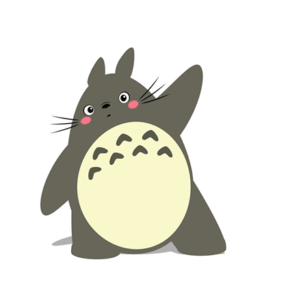  
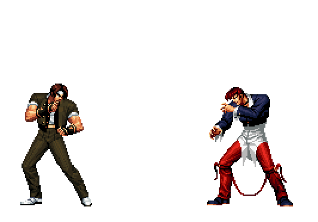  
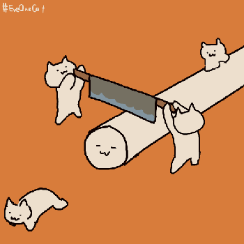  
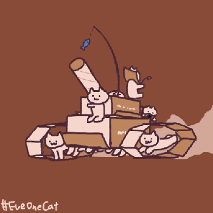  
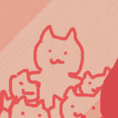  
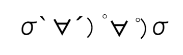  
  
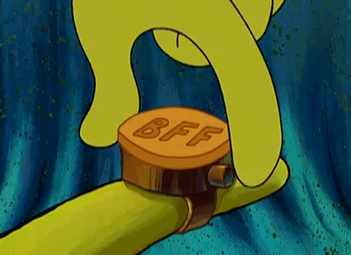  
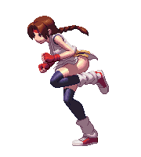  
  
  
  
  
  
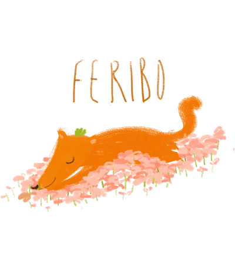  
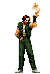  
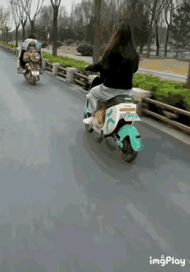  

</details>

### Optimization (implemented)

This section records what the program used to do, what it does now, and the
measured difference. The full design write-up lives in
[docs/Architecture.md](./docs/Architecture.md).

It happened in two stages, and they pay off in different places:

| stage | what it changed | where the payoff is |
|---|---|---|
| 1. index + on-demand compositing | a frame is no longer a full RGB canvas; it is the indices of its own rectangle, composited into one canvas that lives across frames | **memory**: 111.3 MB → 9.5 MB on `13logo`, 1.43 GB → 50 KB of frame data on the stress case |
| 2. dirty-rectangle output | only the region that can have changed is converted and uploaded; the player keeps no full-canvas buffer at all | **per-frame work**: 7% of the full-canvas upload on `13logo`, and one full-canvas pass and a `W*H*4` buffer removed everywhere |

#### What was wrong (stage 1)

The first version decoded a GIF into **one full canvas of RGB pixels per image**:

```
GIF file
  -> LZW decode one image
  -> colour-index buffer
  -> walk every pixel of the whole canvas
  -> materialise a complete IMG_FRAME[] for that frame
  -> repeat for every image, keeping all of them
```

Nothing about the format requires that. An image block only ever carries the
pixels of **its own rectangle**; everything outside it is inherited from the
canvas. Storing a full canvas per frame multiplies the real cost by
`canvas area / rectangle area`, which for typical GIFs is one to three orders of
magnitude.

Measured on the sample assets, peak working set while decoding:

| file | canvas | frames | peak before | peak after |
|---|---|---|---|---|
| `assets/13logo.gif` | 800x600 | 75 | 111.3 MB | **9.5 MB** |
| `assets/12eat.gif` | 640x614 | 77 | 102.3 MB | **23.3 MB** |
| `lm.gif` | 440x440 | 80 | 59.0 MB | **12.4 MB** |
| `assets/16dapipi.gif` | 268x384 | 109 | 55.6 MB | **20.6 MB** |
| synthetic stress case | 400x400 | 3200 | **1502.8 MB** | **6.3 MB** |

The stress case is a generated GIF that changes only a 4x4 patch per frame. In
bytes, its frames are `3200 * 400 * 400 * 3 = 1.43 GB` before and
`3200 * 4 * 4 = 50 KB` after; the 6.3 MB measured peak is that plus the canvas,
the output frame, the compressed file data and the process baseline.

#### What it does now — stage 1: index data + on-demand compositing

Decoding keeps only the **indexed pixels of each rectangle** plus the metadata
needed to place them. Compositing is **on demand**: one frame at a time is layered
onto a canvas that lives across frames, instead of every frame being materialised
as its own full picture.

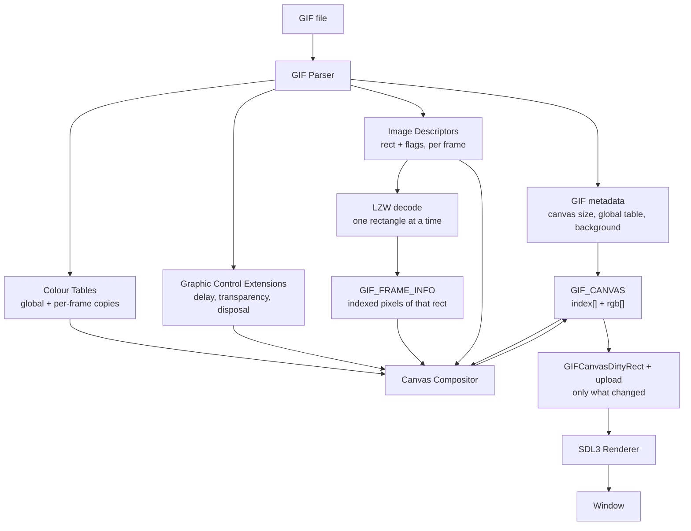
```mermaid
flowchart TD
    A["GIF file"] --> B["GIF Parser"]
    B --> C["GIF metadata<br/>canvas size, global table, background"]
    B --> D["Image Descriptors<br/>rect + flags, per frame"]
    B --> E["Colour Tables<br/>global + per-frame copies"]
    B --> F["Graphic Control Extensions<br/>delay, transparency, disposal"]

    D --> G["LZW decode<br/>one rectangle at a time"]
    G --> H["GIF_FRAME_INFO<br/>indexed pixels of that rect"]

    C --> I["GIF_CANVAS<br/>index[] + rgb[]"]
    E --> J["Canvas Compositor"]
    F --> J
    H --> J
    D --> J
    I --> J

    J --> I
    I --> K["GIFCanvasDirtyRect + upload<br/>only what changed"]
    K --> L["SDL3 Renderer"]
    L --> M["Window"]
```

Per frame the caller runs a fixed three-step sequence:

```c
GIFCanvasCompose(&canvas, animation, i);        // layer frame i onto the canvas
GIFCanvasOutputRect(&canvas, screen, W, &dirty); // move only the dirty rectangle
GIFCanvasApplyDisposal(&canvas, animation, i);  // prepare the canvas for frame i+1
```

The order matters and is part of the contract: disposal describes the canvas the
**next** frame starts from, so it must not be applied before the current frame has
been read out.

##### Why the canvas keeps two arrays

The canvas holds both an index view and an RGB view:

* `rgb[]` — what each pixel currently *looks like*. This is the one that has to be
  there: a pixel carried over from an earlier frame keeps the colour that frame
  gave it, and that colour **cannot** be recovered from `(index, current palette)`:
  the index was encoded against a different table. GIFs routinely give frames their
  own table - `assets/8yori.gif` maps index 0 to `(0,0,112)` locally and
  `(115,246,18)` globally.
* `index[]` — what each pixel currently *is*, in the index domain; disposal 3
  snapshots and restores it alongside `rgb[]`. Being precise about what it does
  **not** do: the transparency test compares the incoming frame's decoded index,
  and the disposal-2 fill writes the background index without reading the canvas.
  Every read of `canvas->index` is the disposal-3 snapshot, so no output path
  consumes it today - it is kept to keep the canvas state self-describing (and as
  the basis for index-domain work such as palette animation or minimal-difference
  uploads), not because dropping it would draw the wrong picture.

Only **one** such canvas exists (not one per frame), so it is a constant
`W * H * 4` cost (`index[]` + `rgb[]`). Disposal 3's saved snapshot is allocated
lazily (only once a frame actually uses disposal 3) and is **canvas-sized**, not
rectangle-sized: sizing it from the first disposal-3 frame's rectangle overflowed
the heap as soon as a later frame was larger (`lm.gif` frame 35 is 316x313, frame
36 is 329x316).

##### Where the work actually happens

"On demand" applies to **compositing**, not to decoding, and it is worth being
precise about which buffers are touched per frame:

| step | what it walks | cost per frame |
|---|---|---|
| decode (once, at load) | every image block | `sum(rect area)` bytes of index data |
| `GIFCanvasCompose` | **only the frame's rectangle** | `rect_w * rect_h` writes; transparent pixels are skipped entirely |
| `GIFCanvasApplyDisposal` | only the drawn rectangle (the saved rect for disposal 3) | `rect_w * rect_h` |
| `GIFCanvasDirtyRect` | nothing - it is arithmetic | O(1) |
| `GIFCanvasOutputRect` / upload to the GPU | **only the dirty rectangle** | `dirty_w * dirty_h * 3` copy + upload |
| `GIFCanvasOutput` (still available) | the whole canvas | `W * H * 3`, for callers that want one standalone picture (the BMP writer does) |

#### What it does now — stage 2: only the changed rectangle

The dirty rectangle is not a guess. It is

```
dirty(i) = rect(i)  ∪  (disposal(i-1) in {2,3} ? rect(i-1) : ∅)
```

clipped to the canvas - the frame being drawn now, plus the area the previous
frame's disposal has just rewritten underneath it. Pixels outside that union
cannot have changed since the previous frame was shown, which is why a caller that
keeps its screen between frames can touch only this region and stay pixel-identical
to a full-canvas output. Frame 0 reports the whole canvas, because at that point
nothing has been displayed yet. Full-canvas animations get nothing out of this (and
lose nothing); patch-based ones get a lot - see the measured ratios below.

#### Other measured improvements

Besides memory, four hot spots were removed:

| change | effect |
|---|---|
| Parser no longer walks the whole canvas per frame | a frame that changes 16 pixels costs 16 pixel writes, not `frames x canvas` |
| `lzw_table_str` per-code `malloc`/`free` replaced by a stack buffer | allocations for `16dapipi.gif` dropped from **7,598,733 to 22,124** (~344x); `build_check/leakcheck.c` re-measures 22,023 by counting allocations at link time |
| output buffer pre-sized instead of grown by `realloc` | decode time for the sample assets fell by **29-61%** |
| only the dirty rectangle is converted and uploaded | **52.4%** of the full-canvas pixels across the 18 assets (range 7% .. 100%); the full-canvas `W*H*4` staging buffer is gone, and the RGB->RGBA conversion is fused into the texture write instead of being a separate full-canvas pass |

Measured dirty-rectangle ratio per file (`build_check/dirtycheck.exe <gif> -`):

```
13logo 7.1%   4catpick 26.5%  10flower 40.4%  lm 43.0%      5ooqq 44.2%
9look 44.5%   12eat 54.8%     2catcut 60.8%   1kof 70.4%     3catboom 86.7%
6dance 97.2%  11plane 100%    14fox 100%      15kyo 100%     16dapipi 100%
7friends 100% 8yori 100%      test 100%
```

Seven of the eighteen animations draw the whole canvas every frame, so for them
there is nothing to skip - the win there is the removed staging buffer and the
fused conversion, not the upload size. For `13logo` (800x600 canvas, ~380x144
patches) 93% of the upload disappears.

#### Current status

Verified against an independent Python compositor written from the GIF
specification (`build_check/ref_composite.py`, whose LZW is a separate
from-spec implementation in `build_check/lzwref.py`):

```
BMP output vs spec reference (assets)  : 18/18 files, 718 frames, 0 mismatching pixels
BMP output vs spec reference (crafted) : 13/16 files, 15 frames, 0 mismatching pixels
                                         (3 of the 16 are refused rather than
                                          compared: 2 malformed files the parser
                                          rejects cleanly, 1 too truncated for the
                                          reference to read)
incremental screen vs spec reference   : 18/18 assets (718 frames) and 12/16
                                         crafted cases (15 frames), 0 frames differ -
                                         a screen kept across frames by applying only
                                         the dirty rectangle is byte-identical to a
                                         full composite
SDL texture accumulation vs canvas     : 30/30 decodable inputs, 733 frames
                                         re-rendered and read back through a real SDL
                                         streaming texture, 0 mismatching pixels out
                                         of 148.8M compared
real assets                            : 0/18 decode failures
malformed / truncated inputs           : 0/16 crashes
determinism (32 inputs x 3 runs)       : 0 unstable, exit codes only 0 (decoded)
                                         or 1 (rejected) - never a crash
allocation balance (34 inputs)         : 0 leaked blocks: decode + clear, and a
                                         second playback pass that allocates
                                         nothing at all (build_check/leakcheck.c)
peak memory re-measured (decode -> playback, MB)
                                       : 13logo 6.4 -> 9.5, 12eat 20.6 -> 23.3,
                                         16dapipi 20.6 -> 20.6, 11plane 16.7 -> 17.9,
                                         lm 11.2 -> 12.4
```

All of it re-runs with one command - `make check` builds the parser plus the five
harnesses in `build_check/` and runs every check above:

```bash
make all player     # the program itself
make check          # parser.exe + the audit binaries, then 'ALL CHECKS PASSED'
```

Individual checks stay usable on their own:

```bash
make parser
python build_check/verify_assets.py                    # BMP vs the spec reference
python build_check/verify_dirtyrect.py                 # incremental screen vs reference
python build_check/verify_dirtyrect.py build_check/cases/*.gif
python build_check/verify_sdl.py                       # through a real SDL texture
./build_check/leakcheck.exe assets/8yori.gif           # allocation balance, one line
./build_check/dirtycheck.exe assets/13logo.gif -       # dirty-rectangle ratio only
```

The BMP comparison is reproducible on its own too - it runs `parser.exe` into a
scratch directory, composites the same file with the Python reference and decodes
the BMPs back pixel by pixel:

```bash
make parser
python build_check/verify_assets.py            # every asset, plus the crafted cases
python build_check/verify_assets.py build_check/cases/*.gif
```

For the vocabulary behind all of this (what an index, a palette, a canvas and
compositing actually are, with diagrams), see
**[docs/Concepts.zh-CN.md](./docs/Concepts.zh-CN.md)**.

### Player

Use SDL3 devel 3.4.16 mingw renderer.

```bash
make player
.\player.exe .\assets\xxx.gif
```

```text
                         GIF File
                            │
                            ▼
                    ┌──────────────┐
                    │  GIF Parser  │
                    └──────┬───────┘
                           │
             GIF_FRAME_INFO[] + palette
                           │
                           ▼
                    ┌──────────────┐
                    │ LZW Decoder  │   one rectangle at a time
                    └──────┬───────┘
                           │
                     Color Index[]
                           │
                           ▼
                  ┌─────────────────┐
                  │ Canvas Compositor│
                  │                 │
                  │ index[] + rgb[] │
                  │ Transparency    │
                  │ Disposal        │
                  └────────┬────────┘
                           │
                   one dirty rectangle
                           │
                           ▼
                    ┌──────────────┐
                    │ SDL3 Renderer│
                    └──────┬───────┘
                           │
                           ▼
                        Window
```

The animation handed to the player holds only index data:

```text
player.exe xxx.gif
        │
        ▼
GIFParserGetAnimationFromFile()
        │
        ▼
 IMG_ANIMATION
 ┌────────────────────────────────────┐
 │ width, height, count               │
 │ global_palette[], background_index │
 │ frames[0] -> GIF_FRAME_INFO        │
 │   pixels[]   (rect-sized, 1B/px)   │
 │   left, top, width, height         │
 │   interlaced, has_transparency     │
 │   transparent_index                │
 │   disposal_method, delay_ms        │
 │   palette[]  (this frame's table)  │
 │ frames[1] ...                      │
 └────────────────────────────────────┘
        │
        ▼
   GIF_CANVAS (one, reused)
   ┌────────────────────────┐
   │ index[]  index domain  │
   │ rgb[]    composited    │
   │ saved[]  disposal 3    │
   └────────────────────────┘
        │  GIFCanvasDirtyRect(i) -> LockTexture(that region only)
        ▼
   SDL_Texture <- only the pixels that changed this tick
        │
        ▼
      Window
```

