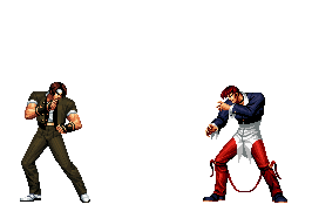
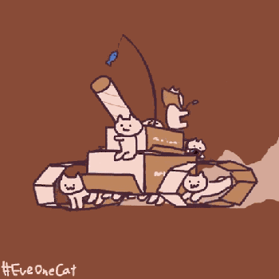
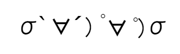
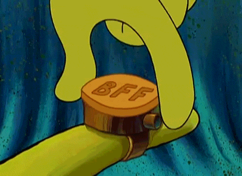

## GIF Parser
### Compile On Windows (Use [Mingw64](https://winlibs.com/))    
```bash  
# create a gif picture test.gif  
make creator  
./creator.exe  

# load file to GIF structure and output a same picture from GIF structure  
make parser  
./parser.exe [FileName]  
```  
  
### Manuals  
Using `parser.exe [filename]` to load a file when you have passed compile. The `parser.exe` will load GIF file transform it to internal data structure and output a same gif picture, it also decomposes gif to bmp in many frames (or maybe one frame). All of gif picture in assets have passed test, and their frames in folder [`frames`](./frames/) (I just upload those take me a lof of problem, although their frames generated).  
The GIF structure mainly consist of Link List.   
```C
typedef struct GIF {
  // File Header - 6Bytes fixed section  
	GIF_HEADER    Header;                    
  // Logical Screen Descriptor - 7Bytes fixed section  
	GIF_LOGICAL_SCREEN_DESCRIPTOR   LogicalScreenDescriptor;   
  // Global Color Table - need to calculate size  
	GIF_COLOR_TABLE   *GlobalColorTable;         
  // Application extension      - link list header  
	GIF_APP_EXT_DATA    *AppExtHeader;             
  // Comment extension          - link list header  
	GIF_COMMENT_EXT_DATA    *CommentExtHeader;         
  // Graphics Control extension - link list header  
	GIF_GRAPHICS_EXT_DATA   *GraphicsExtHeader;        
  // ImageData extension        - link list header  
	GIF_IMAGE_DATA    *ImageDataHeader;          
  // Record extension and image data order in file   
	GIF_COMPONENT_DATA    ComponentOrder;    
  // Here are how many frames in gif  
  UINTN   FramesCount;        
  // End label - 1Bytes fixed section, the value = 0x3B  ';'  
	CHAR    trailer;  								 
} GIF;
```  
We transform its frames to bmp by different disposal method in gif, usually repainted a range or reserved a range. It depends on `graphics.GIF_GRAPHICS_EXT_DATA.flag_disposal_method`.   
When we load gif file, we record order of extension and image data in `ComponentOrder` (all of them have their mark), and when we get file from gif structure, we load data via `ComponentOrder`.  
  
### A Bug  
When program parses No.5 gif picture ([`5ooqq.gif`](./assets/5ooqq.gif)), it always couldn't free data buffer in main function (`frame_buffer`). Maybe there memory is out of bound, and I have no energy to solve it at present.  
### Reference  
[GIF Wiki](https://en.wikipedia.org/wiki/GIF)  **Extremely Recommend!!**
[GIF Animation](http://giflib.sourceforge.net/whatsinagif/animation_and_transparency.html)  **Extremely Recommend!!**  
[GIF Overview1 - English reference "What is GIF"](http://giflib.sourceforge.net/whatsinagif/bits_and_bytes.html)  **Extremely Recommend!!**  
[GIF Overview2](https://blog.csdn.net/wzy198852/article/details/17266507)  
[GIF Overview3](https://www.cnblogs.com/qcloud1001/p/6647080.html)  **Recommend!!**  
[Comprehend GIF format - This paper is enough](https://www.ihubin.com/blog/audio-video-basic-17-gif-file-format-detail/)  **Recommend!!**  
[How to storage image in GIF - LZW Compression](http://giflib.sourceforge.net/whatsinagif/lzw_image_data.html)  
[GIF Example1](https://blog.csdn.net/GrayOnDream/article/details/123167897) **Recommend!!**  
[GIF Example2](https://www.jianshu.com/p/38743ef278ac)  
[BMP Overview](https://www.cnblogs.com/l2rf/p/5643352.html)  

### GIF Essentials  
Extension block start with `0x21`(ASCLL: `!`) and `Extension Label` follows it.  
`0xFF` is Application Extension.  
`0xF9` is Graphics Control Extension.   
`0xFE` is Comment Extension.  
`0x01` is Plain Text Extension.  
All extension block terminator is `0x00`.  

The `Image Descriptor` start with `0x2C`(ASCLL: `,`)  `Local Color Table` and `Image Data` follow it.   
`Image Data` terminator is also `0x00`, and there are data block (`block size` \+ `data byte`) processed by LZW algorithm maybe repeat many times.   

GIF file always terminated by a byte with a value of `0x3B`(ASCLL: `;`).  

Color index amount (Size of Color Table) must be power of 2, assume we use `M` colors and `size of color table` is `N`, which must $2^{(N+1)} \geq M$, if $N > M$ we set $N - M$ color(s) (RGB) occupy excess space but do not use that(those) color(s).

GIF uses index anf color table set each pixel color, color table max amount is $2^{7+1}=256$ because there are 3 bits set size of color table, and there are 3 bits set color resolution(or called it color depth), so GIF color has R(0~255) G(0~255) B(0~255), but it has colors max 256 because of size of color table.  
  
### BMP Essentials  
BMP have file image header and color data, the image header consist of bmp file header[14Bytes] and bmp information header[40Bytes]. You can see at [bmp.h](./bmp.h).  

BMP storage color data order is **BGR**, not RGB, this is important. The file size calculated follow (Byte):  
$Size = (PixelWidth * PixelHeight * BitPerPixel) / 8$  
For gif to bmp, BitPerPixel always is 24.  
  
### test.gif  
it created by pragma `gif_creator`, and it will be parsed in pragma `gif_parser`  
  

### Mainly Resource  
   
  
  
  
  
  
  
  
  
  
  
  
  
  
