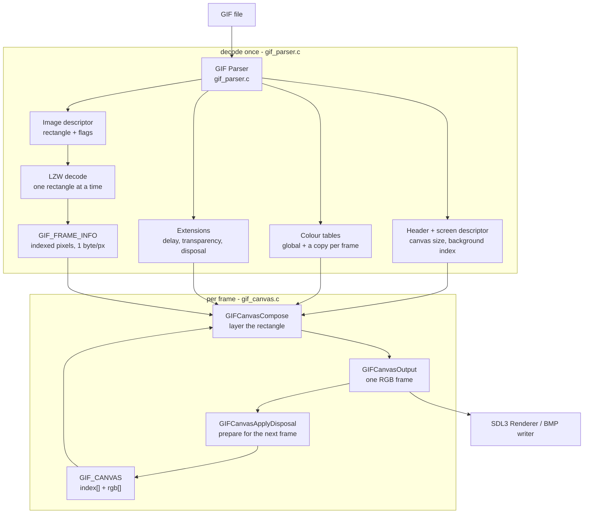

# GIF Parser & Player — Architecture and Internals

> 中文版: [Architecture.zh-CN.md](./Architecture.zh-CN.md)
>
> New to the vocabulary (palette index, canvas, compositing)? Start with the
> illustrated primer: [Concepts.zh-CN.md](./Concepts.zh-CN.md) (中文)

This document explains how this project parses a GIF and plays it, from the
overall shape of the code down to the details that are easy to get wrong. It is
written to be read on its own; the [README](../Readme.md) has the format
cheat-sheet and the list of references.

The two files that matter most are:

| file | responsibility |
|---|---|
| `gif_parser.c` | bytes → structure. Reads the file, decodes LZW, produces one indexed frame per image block. Knows nothing about canvases. |
| `gif_canvas.c` | structure → picture. Applies transparency and disposal, produces RGB. Knows nothing about file layout. |

Everything else (`main.c`, `player.c`) is a consumer of those two.

---

## 1. The shape of the problem

A GIF is a *streaming* format. It is not a list of independent pictures: each
image block carries only the pixels of **its own rectangle**, and the rest of the
canvas is inherited from whatever came before. The file expresses this with three
per-frame controls:

* **transparency** — "do not draw this pixel, keep what is underneath";
* **disposal** — what to put back into the canvas *after* the frame has been shown;
* **delay** — how long to show the frame.

So a correct decoder has to do two separate things:

1. **Decode** each image block into the indices of its rectangle.
2. **Composite** those rectangles, in order, onto a canvas, honouring
   transparency and disposal.

Keeping those two steps in separate translation units is the single most useful
decision in this codebase. The naive alternative — decode straight into a
full-canvas RGB buffer per frame — is what the first version did, and it costs
`canvas_area x 3` bytes per frame regardless of how little the frame actually
changes (see [README](../Readme.md) for the measured numbers).

---

## 2. Data model

### 2.1 Parsed file: `GIF`

`gif.h` mirrors the on-disk grammar: header, logical screen descriptor, global
colour table, then four linked lists (application extensions, comment
extensions, graphic control extensions, image data) plus a `ComponentOrder`
array recording the order in which those blocks appeared, so the file can be
rebuilt byte-for-byte.

Each list starts with a **dummy sentinel node** and real nodes hang off it. That
is why every traversal in the codebase starts at `...->next`.

```c
typedef struct GIF_IMAGE_DATA {
    GIF_IMAGE_DESCRIPTOR image_descriptor; // rect + flags, 10 bytes on disk
    GIF_COLOR_TABLE *local_color_table;
    GIF_ONE_FRAME_DATA one_frame_data;     // LZW min code size + sub-block chain
    struct GIF_IMAGE_DATA *next;
} GIF_IMAGE_DATA;
```

`#pragma pack(push, 1)` is used throughout `gif.h`, so these structs can be
`memcpy`'d straight from the byte stream. The bit-fields (`flag_interlace`,
`flag_disposal_method`, ...) are filled by **explicit bit unpacking** rather than
by copying a packed struct over them, because the address of a bit-field cannot
be taken and its layout is not portable.

### 2.2 Decoded animation: `IMG_ANIMATION`

This is the interface between the parser and a renderer. It holds **no RGB
pixels**:

```c
typedef struct {
    UINT8 *pixels;              // rect-sized, 1 byte per pixel, file row order
    UINTN left, top, width, height;
    BOOL  interlaced;
    BOOL  has_transparency;
    UINT8 transparent_index;
    UINT8 disposal_method;
    UINT32 delay_ms;
    GIF_COLOR_TABLE *palette;   // this frame's table (own copy if it had one)
    UINTN palette_entries;
} GIF_FRAME_INFO;

typedef struct {
    UINTN width, height, count;
    GIF_FRAME_INFO *frames;
    GIF_COLOR_TABLE *global_palette; // owned copy
    UINTN global_palette_entries;
    UINT8 background_index;
} IMG_ANIMATION;
```

Two details are important:

* **`pixels` stays in file row order.** For an interlaced frame the rows are the
  four interlace passes, not the display order; re-ordering happens while
  compositing. Storing them de-interlaced would need a second buffer and a copy.
* **The palettes are copies, not borrowed pointers.** `GIFParserGetAnimationFromFile`
  frees the parsed `GIF` before returning, so a frame that kept pointing at
  `GIF_IMAGE_DATA::local_color_table` would dangle. (This was a real bug: the
  symptom was colours that existed in no palette, because the memory had been
  recycled.)

### 2.3 Composite state: `GIF_CANVAS`

```c
typedef struct {
    UINTN width, height;
    UINT8 *index;      // what each pixel currently IS
    IMG_FRAME *rgb;    // what each pixel currently LOOKS LIKE
    UINT8 *saved;      // pre-draw snapshot (index then rgb), for disposal 3
    UINTN pending_width, pending_height; // rect drawn by the last Compose
} GIF_CANVAS;
```

The two parallel views:

* `rgb[]` answers "what colour is this pixel now?", and it is the only view any
  output path reads. A pixel carried over from an
  earlier frame keeps the colour **that frame** gave it, and that colour cannot be
  recomputed from `(index, current palette)` — the index was encoded against a
  different table. `assets/8yori.gif` gives every frame its own table that maps
  index 0 to `(0,0,112)`, while the global background index 0 is `(115,246,18)`;
  re-rendering carried-over pixels through the current frame's table visibly
  recolours the picture.
* `index[]` is the same canvas in the index domain; it is snapshotted and
  restored together with `rgb[]` for disposal 3. Note what it is **not**: the
  transparency test compares the *incoming frame's* decoded index against
  `frame->transparent_index`, and the disposal-2 fill writes the background index
  without reading the canvas at all. Every read of `canvas->index` in this
  codebase lands in the disposal-3 snapshot, so it is currently a
  write-and-restore view that no output path consumes. It is kept because it makes
  the canvas state self-describing (and is the basis for any future index-domain
  work such as palette animation or minimal-difference uploads), not because
  `rgb[]` alone would produce a wrong picture.

### 2.4 How the pieces fit together



The `compose` box is the per-frame cycle: the canvas goes in, the rectangle is
layered on, the picture comes out, and only then does the disposal adjust the
canvas for the next iteration. The `decode` box runs once per file and produces no
pixels.

---

## 3. Reading the file without reading past the end

### 3.1 The cursor

The parser never walks a bare pointer. Every read goes through a bounds-checked
cursor:

```c
typedef struct {
    const UINT8 *data;
    UINTN size;
    UINTN pos;
    BOOL bad;    // set when a read went past the end
} _GIF_READER;
```

with four operations: `_GIFReaderByte` (returns -1 at EOF), `_GIFReaderCopy`,
`_GIFReaderSkip`, and `_GIFReaderHas`. Any attempt to read past the end sets
`bad` and the parse loop stops cleanly.

This matters more than it looks. The previous version was a single
`memcpy(dst, *src, size)` that had no idea how many bytes were left, so a
six-byte file was enough to trip the stack protector, and a truncated sub-block
silently read into unrelated heap. With the cursor, malformed input is either
recovered from or rejected — never trusted.

### 3.2 The main loop

```
read 6-byte header        verify "GIF" and the revision (87a and 89a both accepted)
read 7-byte screen desc.  canvas size, background index, global-table flag
read global colour table  2^(N+1) entries of RGB
loop:
    read one byte
      0x3B ';'  -> trailer, stop
      0x21 '!'  -> read label, dispatch to _HandleExtension
      0x2C ','  -> _HandleImageData
      anything else -> skip (and keep going)
```

Three details:

* The loop is **byte-driven, not record-driven**. Block introducers are single
  bytes and blocks are self-describing, so reading one byte and dispatching is
  the natural shape.
* Extensions whose label we do not implement are **skipped generically**
  (`label + sub-block chain + 0x00`). Not skipping them is a trap: the payload
  bytes get re-read as introducers, and a payload containing `0x2C` makes the
  parser chase a non-existent image block forever. There is a regression case for
  exactly this (`build_check/cases/unknown_ext_trap.gif`).
* A `0x3B` inside block data is not a trailer. Data arrives through the
  sub-block grammar, so the parse can only end at a block boundary; anything the
  document did not consume is recorded afterwards as `trailer_tail` (see 3.4).

### 3.3 Sub-block chains

Anything variable-length in GIF is a chain of `[size][size bytes]...` terminated
by a zero byte. Every extension body and every image's LZW payload uses it:

```c
for (;;) {
    int size = _GIFReaderByte(r);
    if (size < 0) return FALSE;      // truncated
    if (size == 0) break;            // terminator
    node = malloc(...); copy(size); append;
}
```

### 3.4 Preserving trailing bytes

Some encoders append data after the trailer — `assets/16dapipi.gif` carries 16
bytes. They are not part of the format, but dropping them makes a
parse → rebuild round trip differ. `GIF` therefore carries:

```c
CHAR *trailer_tail;
UINTN trailer_tail_size;
```

recorded **after the main loop**, from the parse's real end position, not at the
first `0x3B` seen. `GIFParserGetDataBufferFromGif` re-emits them after the
trailer, which makes 17 of the 18 sample files byte-exact round trips.

---

## 4. LZW

GIF's image data is LZW-compressed with variable code width.

* The stream starts with a **clear code** `2^min_code_size`. Codes are packed
  LSB-first.
* The code width starts at `min_code_size + 1` and grows by one each time the
  dictionary crosses a power of two, up to 12 bits.
* The **end-of-information code** is `2^min_code_size + 1`; the decoder stops when
  it sees it.
* A code expands to a string; LZW's standard trick handles the one case where the
  decoder must guess (the encoder used an entry the decoder has not built yet).

The entry chain is stored as `(value, previous code, length)`, so expanding a code
is a walk backwards along `prev`:

```c
unsigned long lzw_table_expand(struct lzw_table *t, unsigned int code,
                               unsigned char *dst, unsigned long cap);
```

**Two implementation notes that came out of profiling:**

* Expansion writes into a **caller-owned stack buffer** (`unsigned char
  stack[LZW_MAX_ENTRIES]`). The original allocated a throw-away `darray` per
  expanded code — one `malloc`/`free` pair for every code in the stream. For
  `16dapipi.gif` that was 7.6 million allocations; it is now 22 thousand.
* The output buffer is **pre-sized** from the rectangle's pixel count
  (`lzw_decompress(..., expected_size, ...)`) instead of starting at 4 KB and
  doubling, which removes a chain of `realloc` + copy.

Because the chain is walked tail-to-head, the bytes land in `dst` **reversed**;
the decoder emits them backwards into the output.

One subtlety worth knowing if you touch this code: `lzw_decompress` allocates the
output itself and returns it through a `unsigned char **`. Passing a
pre-allocated buffer to it leaks that buffer, because the callee overwrites the
pointer. The fix is to pass `NULL`.

---

## 5. Compositing

`gif_canvas.c` is where correctness lives. The caller runs, per frame:

```c
GIFCanvasCompose(&canvas, animation, i);        // layer frame i
GIFCanvasOutput(&canvas, animation, pixels);    // read the picture out
GIFCanvasApplyDisposal(&canvas, animation, i);  // prepare for frame i+1
```

### 5.1 Why that order is a contract

Disposal answers "what should the canvas look like *after* this frame has been
shown?". It therefore modifies the canvas for the **next** frame. Applying it
before reading the picture out corrupts the current frame: with disposal 2 the
whole rectangle — including the pixels just drawn — gets overwritten by the
background colour. This is a live bug that was found and fixed twice in this
codebase, which is why the header spells the order out.

### 5.2 Where "on demand" actually applies

"On demand" refers to **compositing**, not to decoding. Worth being precise about
which buffers each step touches:

| step | what it walks | cost per frame |
|---|---|---|
| decode (once, at load) | every image block | `sum(rect area)` bytes of index data |
| `GIFCanvasCompose` | **only the frame's rectangle** | `rect_w * rect_h` writes; transparent pixels are skipped |
| `GIFCanvasApplyDisposal` | only the drawn rectangle (the saved rect for disposal 3) | `rect_w * rect_h` |
| `GIFCanvasDirtyRect` | nothing at all | O(1) arithmetic |
| `GIFCanvasOutputRect` / upload to the GPU | **only the dirty rectangle** | `dirty_w * dirty_h * 3` copy and upload |
| `GIFCanvasOutput` (kept for standalone pictures) | the whole canvas | `W * H * 3` copy |

Everything in that table is now incremental except decoding; see 5.7 for the dirty
rectangle itself. It is worth knowing the shape of that last saving: it is exactly
as large as the rectangles are small. Across the eighteen sample assets the dirty
area is 52% of the full-canvas area, but the distribution is bimodal - `13logo`
needs 7%, while seven files whose every frame covers the whole canvas need 100%. A
full-canvas animation gains nothing and loses nothing; a patch-based one gains a
lot.

### 5.3 Compose

Per frame, in order:

1. **Clip** the rectangle to the canvas. Malformed files may place a frame partly
   or wholly outside; the comparison is written as `left < canvas.width` plus a
   subtraction so a hostile rectangle cannot overflow it.
2. **Snapshot** (only for disposal 3) both `index[]` and `rgb[]` for the
   rectangle. The buffer is sized for the *whole canvas*, since the first
   disposal-3 frame is not necessarily the largest (`lm.gif` frame 35 is 316x313,
   frame 36 is 329x316).
3. **Draw**, row by row. For each pixel:
   * transparent index → leave the canvas pixel completely alone (both views);
   * otherwise → write the index and its colour from **this frame's** palette.
   For interlaced frames the source row is looked up through
   `_InterlaceRowOrder`, which maps display row → stored row.
4. Remember the drawn rectangle in `pending_width`/`pending_height` so the
   disposal step knows what to restore.

### 5.4 Interlace

An interlaced image stores its rows in four passes:

```
pass 0: rows 0, 8, 16, ...
pass 1: rows 4, 12, ...
pass 2: rows 2, 6, 10, ...
pass 3: rows 1, 3, 5, ...
```

The mapping is built once per frame into a small array. Note it permutes the
**rectangle**, not the canvas: for an interlaced sub-rectangle the two differ, and
using the canvas height would interleave rows outside this frame's data.

### 5.5 Disposal

Applied to the rectangle just drawn:

| value | meaning | action |
|---|---|---|
| 0 | unspecified | keep the canvas |
| 1 | do not dispose | keep the canvas |
| 2 | restore to background | fill the rectangle with the **background colour**: the Logical Screen Descriptor background index, rendered through the global table |
| 3 | restore to previous | copy the snapshot taken before the frame was drawn |

Disposal 2 deserves emphasis. The specification says "restore to background
colour", and that means the global table's background entry — **not** the frame's
transparent index colour. Using the transparent index colour looks plausible but
is wrong: the entire point of disposal 2 is that the next frame sees the untouched
background through its transparent pixels. Getting this wrong made every frame of
`assets/8yori.gif` come out in the wrong colour while looking self-consistent.

### 5.6 Output

`GIFCanvasOutput` is a `memcpy` of `canvas->rgb` — the canvas already holds the
finished colours, so there is no per-pixel conversion at this point. Frames that
were never written by any image keep the background colour they were initialised
with.

### 5.7 The dirty rectangle

A full-canvas output is fine for writing one standalone picture (the BMP path does
exactly that), but a player does not need it: its destination — a texture, a
window, a screen — already holds the previous frame. So the library also exposes

```c
BOOL GIFCanvasDirtyRect(const IMG_ANIMATION *animation, UINTN index, GIF_RECT *rect);
VOID GIFCanvasOutputRect(const GIF_CANVAS *canvas, IMG_FRAME *dst, UINTN dst_pitch,
                         const GIF_RECT *rect);
```

`GIFCanvasDirtyRect` is pure arithmetic and returns

```
dirty(i) = rect(i)  ∪  (disposal(i-1) in {2,3} ? rect(i-1) : ∅)
```

clipped to the canvas, with frame 0 reporting the whole canvas. The union with the
*previous* frame's rectangle is the part that is easy to miss: disposal runs after
frame `i-1` was displayed, so the pixels it rewrote underneath are not on the
destination yet. Disposal 0 and 1 change nothing and contribute nothing (a real
saving, because most animations use them).

`GIFCanvasOutputRect` copies that rectangle out with a caller-supplied row pitch, so
a caller can write straight into a persistent screen buffer, or into an SDL texture
locked over exactly that region. `player.c` does the latter and converts RGB to
RGBA as it writes, which is why the full-canvas `W*H*4` staging buffer it used to
keep is gone: the conversion now happens once, on the way into the texture, instead
of once into a buffer and then again into the texture.

This is exact, not heuristic, and it is verified as such: `build_check/dirtycheck.c`
keeps a screen buffer, applies only the dirty rectangle each frame, and compares the
result with the spec reference frame by frame; `build_check/sdlcheck.c` does the
same through a real SDL streaming texture, reading the rendered target back and
comparing it with the canvas.

---

## 6. Producing BMP

`GIFParserAnimationFrameBMP` wraps compose + output + a 24-bit BMP encoder. Two
BMP rules are easy to get wrong:

* rows are stored **bottom-up** (the first row in the file is the bottom row of
  the picture);
* pixel bytes are **BGR**, and each row is padded to a 4-byte boundary.

The padding must be computed from the bytes written **within the row**, not from
the absolute file offset. The 54-byte header is not a multiple of 4, so testing
`offset % 4` inserts two stray bytes at every row boundary and truncates the last
row. That bug produced images that looked like a channel swap; it was not.

---

## 7. Playing it

`player.c` keeps exactly one buffer regardless of frame count: the `GIF_CANVAS`. It
no longer keeps a full-canvas frame buffer at all — the picture is uploaded straight
out of the canvas, one dirty rectangle at a time.

```c
GIFParserGetAnimationFromFile(path, &animation);   // decode once, index data only
GIFCanvasCreate(&canvas, animation);               // one canvas, and that is all

GIFCanvasReset(&canvas, animation);                // start of each loop
for (i = 0; i < animation->count; ++i) {
    poll SDL events;
    GIFCanvasCompose(&canvas, animation, i);
    if (GIFCanvasDirtyRect(animation, i, &dirty)) {
        SDL_LockTexture(texture, &dirty_rect, &pixels, &pitch);   // only this region
        convert canvas->rgb -> RGBA into `pixels`;                // fused, one pass
        SDL_UnlockTexture(texture);
    }
    GIFCanvasApplyDisposal(&canvas, animation, i);
    SDL_RenderClear / RenderTexture / RenderPresent;
    SDL_Delay(max(animation->frames[i].delay_ms, 10));
}
```

The player reuses the canvas across loop iterations, so it calls
`GIFCanvasReset` when it wraps around rather than destroying and recreating it. The
first upload of each loop covers the whole canvas, which is also what re-syncs the
texture with the freshly reset (background-filled) canvas.

Note the shape of the saving: it is exactly as large as the rectangles are small.
Seven of the eighteen sample animations draw the whole canvas on every frame and
gain nothing from it; `13logo` (800x600 canvas, ~380x144 patches) uploads 7% of what
it used to. What every file gains is the removed staging buffer and the fused
conversion.

---

## 8. Testing the thing

A GIF decoder that "looks right" is not evidence of much: wrong disposal, wrong
palette selection and wrong row order all produce plausible pictures. The
verification used throughout this project:

| tool | what it does |
|---|---|
| `build_check/ref_composite.py` | an **independent** compositor written from the specification. It never shared code with the C implementation, so agreement means something. |
| `build_check/lzwref.py` | the reference's own LZW decoder, also written from the specification rather than translated from `lzw/`. |
| `build_check/verify_assets.py` | the end-to-end run: executes the real `parser.exe` in a scratch directory, composites the same file with the reference and compares the BMPs pixel by pixel. |
| `build_check/verify_dirtyrect.py` + `dirtycheck.c` | keeps a persistent screen, updates only `GIFCanvasDirtyRect(i)` each frame and diffs the screen against the reference. This is what makes the dirty rectangle falsifiable: a rectangle one pixel too small leaves a stale pixel that nothing else would catch. |
| `build_check/verify_sdl.py` + `sdlcheck.c` | the same idea through a real SDL streaming texture (dummy video driver, software renderer): upload only the dirty region, render, read the whole target back, compare with the canvas. Verifies the assumption that locking a region leaves the rest of the texture intact. |
| `build_check/verify_all.py` | runs every check above plus the two below and prints one summary. `make check` builds the harnesses and runs this. |
| `build_check/cmp_dumps.py` | compares two frame dumps pixel by pixel and reports which frames differ. |
| `build_check/gifstat.py` | structural inventory: frame count, rectangles, disposal histogram, local tables, interlace, delays. |
| `build_check/concepts_probe.py` | prints the palettes, the decoded indices and the composited output of a file — the numbers behind the illustrated primer, `docs/Concepts.zh-CN.md`. |
| `build_check/memcheck.c` | peak working set, before and during playback. |
| `build_check/leakcheck.c` | counts allocations by wrapping `malloc`/`calloc`/`realloc`/`free` at link time, then asserts that a second playback pass allocates nothing and that clear returns to the baseline. This is what proves the canvas snapshot is released rather than leaked. |
| `build_check/det_check.py` | runs the same input three times and checks the output is identical — catches uninitialised reads and heap corruption that a single run can hide. |
| `build_check/bmp_vs_ref.py` | decodes the produced BMP per spec and compares it with the reference. |
| `build_check/cases/` | 16 crafted edge cases: no GCE, zero frames, truncated sub-block, oversized rectangle, interlaced, `87a`, unknown extension with a `0x2C` trap, and more. |

The reference clips rectangles to the canvas, exactly as a decoder must; without
that, the oversized-rectangle case would make the reference itself crash and the
clipping path in `GIFCanvasCompose` could not be arbitrated.

The lesson that cost the most time: **build the deterministic, self-checking test
first**. Several bugs in this codebase were found only by the spec reference (an
implementation agreeing with itself proves nothing), and one was found only by
allocation counting (a per-frame buffer leak that no functional test could see).
Reading hex dumps by eye produced two wrong conclusions before that.

---

## 9. Things that are easy to get wrong

A condensed list, all of which were live bugs here at some point:

1. **Compose → output → disposal.** Disposal is for the *next* frame.
2. **Disposal 2 fills with the background colour**, from the global table.
3. **Carried-over pixels keep their colour, not their index.** Two canvas views.
4. **The rectangle in the image descriptor is not the canvas.** Never walk the
   whole canvas per frame.
5. **Interlace permutes the rectangle**, not the canvas.
6. **`lzw_decompress` allocates its own output**; do not pre-allocate for it.
7. **BMP row padding is per row**, not per file offset.
8. **A `0x3B` can appear inside block data**; the parse ends at a block boundary.
9. **Local colour tables must be copied** if the parsed `GIF` is freed first.
10. **Missing graphic control extensions are legal.** Default to disposal 0, no
    transparency, no delay.
11. **Every read needs a bound.** Six bytes of input is enough to crash an
    unbounded `memcpy`-style parser.
12. **Measure with counters.** Peak memory, allocation counts and a determinism
    run tell you things that "it renders fine" cannot.

---

## 10. Known limitations

* **Plain Text Extension is consumed, not rendered.** It is skipped correctly so
  the block stream stays aligned, but no text is drawn.
* **`assets/15kyo.gif` is malformed** (its block structure breaks before the
  trailer, and its tail contains an extra `0x00`). The parser recovers the two
  readable frames and writes a valid trailer, so a round trip differs by one byte.
  This is a repair, not a defect.
* **Animation delays are not re-timed for rendering cost.** The player sleeps
  `delay_ms` per frame, so a very slow renderer would drift rather than drop
  frames.
* **Decoding is not incremental, and neither is the file read.** Every frame is
  decoded up front into rectangle-sized index data, and the whole file is read
  into memory first (5.4 MB for the largest sample). What is deferred is the
  *compositing*, not the decoding: memory is `sum(rect area)` plus one canvas,
  not one canvas per frame. A truly streaming decoder (decode on demand and keep
  only the current frame) would remove the per-frame index data as well.
* **`index[]` is currently write-only.** Every read of `canvas->index` is the
  disposal-3 snapshot; no output path consumes it. It costs `W*H` bytes on the
  canvas (and again in the snapshot) and could be dropped without changing a single
  output pixel. It is kept deliberately, as the canvas's self-description and the
  basis for index-domain work (palette animation, minimal-difference uploads).
* **The render pass is still full-screen.** The upload is now limited to the dirty
  rectangle, but every frame still clears the renderer and draws the whole texture
  to the window. Skipping that needs a no-clear path plus a full redraw on expose
  and resize - the next candidate, and a much smaller win than the upload was.
