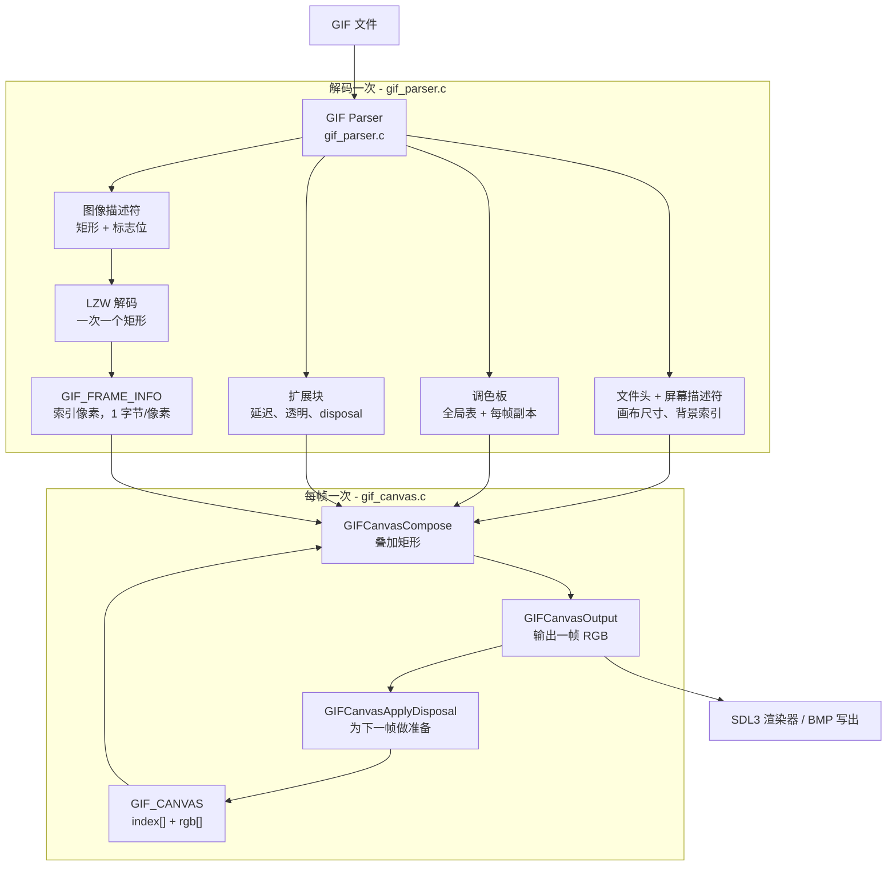

# GIF 解析与播放 —— 架构与实现细节

> English version: [Architecture.md](./Architecture.md)
>
> 如果索引、调色板、画布、合成这些词还很陌生，先看入门图解：[Concepts.zh-CN.md](./Concepts.zh-CN.md)

本文讲解这个项目如何解析并播放一个 GIF：从代码的整体形状，一直讲到那些**特别容易做错**的细节。文档可以独立阅读；格式速查表和参考资料在 [README](../Readme.md) 里。

最关键的是两个文件：

| 文件 | 职责 |
|---|---|
| `gif_parser.c` | 字节 → 结构。读文件、解 LZW、为每个图像块产出一帧**索引数据**。它完全不知道画布的存在。 |
| `gif_canvas.c` | 结构 → 画面。处理透明与 disposal，产出 RGB。它完全不知道文件布局。 |

其余部分（`main.c`、`player.c`）都是这两者的调用方。

---

## 1. 问题的本质

GIF 是一个**流式**格式。它不是一组互相独立的图片：每个图像块只携带**自己矩形范围内**的像素，画布的其余部分继承自之前的内容。文件通过每帧的三个控制项来表达这件事：

* **透明**（transparency）——"这个像素不要画，保留下面的内容"；
* **处置方法**（disposal）——这一帧**显示完之后**，画布该恢复成什么样；
* **延迟**（delay）——这一帧显示多久。

所以一个正确的解码器必须做两件独立的事：

1. **解码**每个图像块，得到其矩形范围内的索引；
2. 按顺序把这些矩形**合成**到画布上，正确处理透明与 disposal。

**把这两步放进两个独立的编译单元，是本项目里最有价值的一个决定。** 天真的替代方案——直接解码成"每帧一幅整画布 RGB"——正是初版的做法，它的代价是每帧固定 `画布面积 × 3` 字节，不管这一帧实际改了多少像素（实测数据见 [README](../Readme.md)）。

---

## 2. 数据模型

### 2.1 解析后的文件：`GIF`

`gif.h` 直接映射磁盘上的语法：文件头、逻辑屏幕描述符、全局调色板，然后是四条链表（应用扩展、注释扩展、图形控制扩展、图像数据），再加一个 `ComponentOrder` 数组记录这些块在文件中的出现顺序——这样才能把文件**逐字节重建**回去。

每条链表都以一个**哑节点（sentinel）**开头，真实节点挂在其后。所以代码里所有遍历都从 `...->next` 开始。

```c
typedef struct GIF_IMAGE_DATA {
    GIF_IMAGE_DESCRIPTOR image_descriptor; // 矩形 + 标志位，磁盘上 10 字节
    GIF_COLOR_TABLE *local_color_table;
    GIF_ONE_FRAME_DATA one_frame_data;     // LZW 最小码长 + 子块链
    struct GIF_IMAGE_DATA *next;
} GIF_IMAGE_DATA;
```

`gif.h` 通篇使用 `#pragma pack(push, 1)`，所以这些结构体可以直接从字节流 `memcpy` 过来。但其中的位域（`flag_interlace`、`flag_disposal_method` 等）是**显式按位解包**填充的，而不是把紧凑结构体整体拷进位域：因为位域无法取地址，而且它的布局不可移植。

### 2.2 解码后的动画：`IMG_ANIMATION`

这是解析器与渲染器之间的接口。它**不持有任何 RGB 像素**：

```c
typedef struct {
    UINT8 *pixels;              // 矩形大小，1 字节/像素，保持文件行序
    UINTN left, top, width, height;
    BOOL  interlaced;
    BOOL  has_transparency;
    UINT8 transparent_index;
    UINT8 disposal_method;
    UINT32 delay_ms;
    GIF_COLOR_TABLE *palette;   // 本帧的调色板（若本帧有 LCT 则为自己的副本）
    UINTN palette_entries;
} GIF_FRAME_INFO;

typedef struct {
    UINTN width, height, count;
    GIF_FRAME_INFO *frames;
    GIF_COLOR_TABLE *global_palette; // 自己的副本
    UINTN global_palette_entries;
    UINT8 background_index;
} IMG_ANIMATION;
```

有两个细节很重要：

* **`pixels` 保持文件行序。** 对交错帧来说，行的排列是四个交错遍（pass），不是显示顺序；重新排序发生在合成阶段。如果在这里就存成交错后顺序，就需要额外一个缓冲和一次拷贝。
* **调色板是副本，不是借用指针。** `GIFParserGetAnimationFromFile` 在返回前就释放了解析出的 `GIF`，所以如果某一帧仍然指向 `GIF_IMAGE_DATA::local_color_table`，那个指针就悬垂了。（这曾经是真实的 bug：症状是出现了**任何调色板里都不存在**的颜色，因为那块内存已被回收重用。）

### 2.3 合成状态：`GIF_CANVAS`

```c
typedef struct {
    UINTN width, height;
    UINT8 *index;      // 每个像素当前"是什么"（索引）
    IMG_FRAME *rgb;    // 每个像素当前"长什么样"（颜色）
    UINT8 *saved;      // 绘制前快照（先是 index，再是 rgb），供 disposal 3 使用
    UINTN pending_width, pending_height; // 最近一次 Compose 绘制的矩形
} GIF_CANVAS;
```

这两个并行视图：

* `rgb[]` 回答"这个像素现在是什么颜色？"，也是**唯一**被出图路径读取的视图。一个从早期帧继承下来的像素，保留的是**那一帧**给它的颜色，而这个颜色**无法**由 `(索引, 当前调色板)` 重新算出来——因为那个索引当初是依据另一张表编码的。`assets/8yori.gif` 给每一帧都配了自己的表，把索引 0 映射到 `(0,0,112)`，而全局背景索引 0 是 `(115,246,18)`；如果用当前帧的表去重新解释继承下来的像素，画面颜色会明显被改掉。
* `index[]` 是同一张画布在**索引域**的样子，disposal 3 会连它一起快照与恢复。需要说清它**不**是什么：透明判定比较的是**本帧解出来的索引**与 `frame->transparent_index`，而 disposal 2 的回填是直接写入背景索引、根本不读画布。这份代码里对 `canvas->index` 的读取全部发生在 disposal 3 的快照里，所以它目前是一个"只写、只被自己快照恢复"的视图，没有任何出图路径消费它。保留它的理由是让画布状态自描述（也是将来做索引域工作的基础，例如调色板动画、按最小差异上传），而不是因为只留 `rgb[]` 会画错。

### 2.4 各部分如何协作



`compose` 这个框就是**每帧的循环**：画布进去、矩形叠上去、画面出来，**之后**才用 disposal 把画布调整成下一帧的起点。`decode` 这个框每个文件只跑一次，而且不产生任何像素。

---

## 3. 读文件时绝不越界

### 3.1 游标

解析器从不直接走裸指针。每一次读取都通过一个带边界检查的游标：

```c
typedef struct {
    const UINT8 *data;
    UINTN size;
    UINTN pos;
    BOOL bad;    // 某次读取越过了末尾时置位
} _GIF_READER;
```

配合四个操作：`_GIFReaderByte`（到末尾返回 -1）、`_GIFReaderCopy`、`_GIFReaderSkip`、`_GIFReaderHas`。任何越过末尾的读取都会置 `bad`，解析循环随即干净地停下。

这件事比看起来重要。之前的版本是一句 `memcpy(dst, *src, size)`，它完全不知道还剩多少字节——所以一个六字节的文件就足以触发栈保护，而一个被截断的子块会静默读进无关的堆内存。有了游标之后，畸形输入要么被恢复，要么被拒绝，**绝不会被信任**。

### 3.2 主循环

```
读 6 字节文件头       校验 "GIF" 与版本（87a 和 89a 都接受）
读 7 字节屏幕描述符   画布尺寸、背景索引、全局表标志
读全局调色板          2^(N+1) 个 RGB 三元组
循环：
    读一个字节
      0x3B ';'  -> trailer，结束
      0x21 '!'  -> 读 label，分派给 _HandleExtension
      0x2C ','  -> _HandleImageData
      其它      -> 跳过该字节并继续
```

三个要点：

* 这个循环是**字节驱动，而不是记录驱动**。块引导符是单字节，块自身带长度描述，所以"读一字节然后分派"是最自然的形状。
* **未实现的扩展 label 会被通用地跳过**（`label + 子块链 + 0x00`）。不跳过就是个陷阱：载荷字节会被重新当作引导符读取，而如果载荷里恰好含 `0x2C`，解析器就会去追一个根本不存在的图像块，**永远循环下去**。项目里有一个专门针对这种情况的回归用例（`build_check/cases/unknown_ext_trap.gif`）。
* **块数据内部的 `0x3B` 不是 trailer。** 数据是通过子块语法读进来的，所以解析只可能在块边界结束；文档没有消费掉的字节会在之后被记录为 `trailer_tail`（见 3.4，本章只讲解析阶段，不涉及未知扩展的处理）。

### 3.3 子块链

GIF 里所有变长内容都是 `[size][size 个字节]...` 的链，以一个零字节结束。每个扩展块的载荷和每个图像的 LZW 数据都用它：

```c
for (;;) {
    int size = _GIFReaderByte(r);
    if (size < 0) return FALSE;      // 被截断
    if (size == 0) break;            // 终止符
    node = malloc(...); copy(size); append;
}
```

### 3.4 保留 trailer 之后的字节

有些编码器会在 trailer 之后追加数据——`assets/16dapipi.gif` 就带了 16 字节。它们不属于 GIF 格式，但如果丢弃，"解析 → 重建"的往返结果就会不一致。因此 `GIF` 里带有：

```c
CHAR *trailer_tail;
UINTN trailer_tail_size;
```

记录时机是**主循环之后**，取解析真正的结束位置，而不是"看到的第一个 `0x3B`"。`GIFParserGetDataBufferFromGif` 会把它们重新写在 trailer 之后，这让 18 个素材中的 17 个实现了字节级精确往返。

---

## 4. LZW

GIF 的图像数据是变长码宽的 LZW 压缩。

* 数据流以**清除码（clear code）** `2^min_code_size` 开始；码按 LSB 优先打包。
* 码宽从 `min_code_size + 1` 开始，每当字典跨越 2 的幂就加 1，直到 12 位。
* **结束码（end-of-information）** 是 `2^min_code_size + 1`，解码器见到它就停。
* 一个码展开成一个字符串；LZW 标准里那个著名的技巧，处理的是解码器**唯一需要"猜"**的情形（编码器用到了解码器还没来得及建立的表项）。

表项以 `(值, 前驱码, 长度)` 存储，所以展开一个码就是沿 `prev` 链往回走：

```c
unsigned long lzw_table_expand(struct lzw_table *t, unsigned int code,
                               unsigned char *dst, unsigned long cap);
```

**两条来自性能剖析的实现要点：**

* 展开时写入**调用方提供的栈缓冲**（`unsigned char stack[LZW_MAX_ENTRIES]`）。原版为**每一个展开的码**分配一个临时 `darray`——数据流里每个码一对 `malloc`/`free`。对 `16dapipi.gif` 而言那是 760 万次分配，现在降到 2.2 万次。
* 输出缓冲按矩形的像素数**预分配**（`lzw_decompress(..., expected_size, ...)`），而不是从 4 KB 开始翻倍增长，从而消掉了一连串 `realloc` + 拷贝。

由于链是从尾向头走的，字节写进 `dst` 时是**逆序**的；所以解码器反向把它们送进输出。

有一个坑，如果你要动这段代码就必须知道：`lzw_decompress` **自己分配输出**，并通过 `unsigned char **` 交回来。若你预先分配一个缓冲传进去，那块缓冲就会泄漏——因为被调用方直接覆盖了指针。正确做法是传 `NULL`。

---

## 5. 合成

`gif_canvas.c` 是正确性的所在。调用方对每一帧执行三步：

```c
GIFCanvasCompose(&canvas, animation, i);        // 把第 i 帧叠上去
GIFCanvasOutput(&canvas, animation, pixels);    // 把画面读出来
GIFCanvasApplyDisposal(&canvas, animation, i);  // 为第 i+1 帧做准备
```

### 5.1 为什么这个顺序是一份契约

Disposal 回答的是"这一帧**显示完之后**，画布应该是什么样"。因此它修改的是**下一帧**的画布。如果在读出画面之前就应用它，当前帧就被破坏了：以 disposal 2 为例，整个矩形——**包括刚刚画上去的像素**——都会被背景色覆盖。这是本项目里被找出来、并且修过**两次**的真实 bug，所以头文件里把这个顺序明确写了出来。

### 5.2 "按需合成"到底按需在哪里

"按需"指的是**合成**，不是解码。每一帧真正动到的缓冲是不一样的，值得讲清楚：

| 步骤 | 遍历范围 | 每帧代价 |
|---|---|---|
| 解码（加载时一次） | 每一个图像块 | `Σ(矩形面积)` 字节的索引数据 |
| `GIFCanvasCompose` | **只有本帧的矩形** | `rect_w * rect_h` 次写入；透明像素直接跳过 |
| `GIFCanvasApplyDisposal` | 只有绘制过的矩形（disposal 3 用存档矩形） | `rect_w * rect_h` |
| `GIFCanvasDirtyRect` | 完全不遍历 | O(1) 的算术 |
| `GIFCanvasOutputRect` / 上传到 GPU | **只有脏矩形** | `dirty_w * dirty_h * 3` 次拷贝与上传 |
| `GIFCanvasOutput`（留给"要一张独立图片"的调用方） | 整个画布 | `W * H * 3` 次拷贝 |

现在除了解码，表里每一项都是增量的；脏矩形本身见 5.7。这个收益的**形状**值得说清：矩形越小省得越多。18 个素材合计，脏面积是整幅面积的 52%，但分布是两极的——`13logo` 只需要 7%，而有 7 个文件每一帧都覆盖整幅画布，需要 100%。整幅动画既没收益也没损失，补丁式动画收益很大。

### 5.3 Compose（叠加）

对每一帧，依次：

1. **裁剪**矩形到画布范围内。畸形文件可能把帧放在画布部分之外甚至完全在外；比较写成 `left < canvas.width` 再加一次减法，这样恶意的矩形不会让比较溢出。
2. **快照**（仅 disposal 3）矩形的 `index[]` 和 `rgb[]`。缓冲按**整个画布**分配，因为第一个 disposal-3 帧不一定是最大的（`lm.gif` 第 35 帧是 316x313，第 36 帧是 329x316）。
3. **绘制**，逐行进行。对每个像素：
   * 索引 == 透明索引 → 完全不动画布上的这个像素（两个视图都不动）；
   * 否则 → 写入索引，并用**本帧的**调色板查出颜色写进 `rgb[]`。
   对交错帧，源行通过 `_InterlaceRowOrder` 查找，它把"显示行"映射到"存储行"。
4. 把绘制过的矩形记在 `pending_width`/`pending_height` 里，这样 disposal 那一步知道该恢复哪里。

### 5.4 交错

交错图像把行分成四遍存储：

```
第 0 遍: 行 0, 8, 16, ...
第 1 遍: 行 4, 12, ...
第 2 遍: 行 2, 6, 10, ...
第 3 遍: 行 1, 3, 5, ...
```

这个映射每帧构建一次，放在一个小数组里。注意它置换的是**矩形**，不是画布：对交错的子矩形来说两者不同，如果用画布高度去算，就会把本帧数据之外的行也交错进去。

### 5.5 Disposal（处置方法）

作用于刚刚绘制过的矩形：

| 值 | 含义 | 动作 |
|---|---|---|
| 0 | 未指定 | 保留画布 |
| 1 | 不处置 | 保留画布 |
| 2 | 恢复到背景 | 用**背景色**填充矩形：逻辑屏幕描述符里的背景索引，经**全局表**取出颜色 |
| 3 | 恢复到之前 | 拷贝绘制前保存的快照 |

disposal 2 值得强调。规范原文是 "restore to background colour"，意思是**全局表的背景项**，而**不是**本帧透明索引对应的颜色。用透明索引色看起来挺合理，但那是错的：disposal 2 的全部意义就在于让下一帧能透过自己的透明像素看到未被触碰的背景。这一点搞错之后，`assets/8yori.gif` 的每一帧都会以错误的颜色输出，而画面本身看起来"自洽"，很难察觉。

### 5.6 Output（输出）

`GIFCanvasOutput` 就是一次 `memcpy(canvas->rgb)`——画布里已经是合成好的颜色，这一步不需要逐像素转换。任何图像帧从未写过的像素，保持它们初始化时的背景色。

### 5.7 脏矩形

整幅输出适合"要一张独立图片"的场合（BMP 那条路就是这么用的），但播放器不需要：它的目的地——纹理、窗口、屏幕——里面**本来就有上一帧**。所以库里另外提供：

```c
BOOL GIFCanvasDirtyRect(const IMG_ANIMATION *animation, UINTN index, GIF_RECT *rect);
VOID GIFCanvasOutputRect(const GIF_CANVAS *canvas, IMG_FRAME *dst, UINTN dst_pitch,
                         const GIF_RECT *rect);
```

`GIFCanvasDirtyRect` 是纯算术，返回

```
脏矩形(i) = 矩形(i)  ∪  (disposal(i-1) ∈ {2,3} ? 矩形(i-1) : ∅)
```

再裁剪到画布；第 0 帧返回整幅画布。其中**和上一帧矩形的并集**是最容易漏掉的部分：disposal 是在第 `i-1` 帧显示**之后**执行的，它改掉的那些像素还没有出现在目的地里。disposal 0/1 什么都不改，也就不贡献任何面积（这是实打实的节省，因为大多数动画用的就是它们）。

`GIFCanvasOutputRect` 按调用方给的行距（pitch）把这块矩形拷出去，于是调用方可以直接写进常驻的屏幕缓冲，或者写进**只锁定了这块区域**的 SDL 纹理。`player.c` 走的是后者，并在写入时顺手把 RGB 转成 RGBA——这正是它过去那个整幅 `W*H*4` 暂存缓冲被删掉的原因：转换现在只发生一次（进纹理的路上），而不是"先转进缓冲、再转进纹理"两次。

这件事是**精确的**，不是启发式，而且按精确来验证：`build_check/dirtycheck.c` 维护一个屏幕缓冲，每帧只应用脏矩形，再逐帧和规范参考比对；`build_check/sdlcheck.c` 则通过一张真实的 SDL 流式纹理做同样的事，把渲染目标读回来和画布比对。

---

## 6. 生成 BMP

`GIFParserAnimationFrameBMP` 把 compose + output + 一个 24 位 BMP 编码器包装在一起。有两条 BMP 规则很容易写错：

* 行是**自底向上**存储的（文件里的第一行是图像的**最下面**一行）；
* 像素字节顺序是 **BGR**，且每一行要补齐到 4 字节边界。

补齐量必须按**行内已写字节数**计算，**不是**按文件绝对偏移。54 字节的文件头不是 4 的倍数，所以用 `偏移 % 4` 判断会在**每一行边界插入两个多余字节**，并把最后一行截断。这个 bug 产生的图像看起来像是通道互换，其实不是。

---

## 7. 播放

`player.c` 无论多少帧都只保留一个缓冲：`GIF_CANVAS`。它不再保留任何整幅帧缓冲——画面直接从画布里按脏矩形一块块上传。

```c
GIFParserGetAnimationFromFile(path, &animation);   // 只解码一次，只留索引数据
GIFCanvasCreate(&canvas, animation);               // 一个画布，就这些

GIFCanvasReset(&canvas, animation);                // 每轮循环开始时重置
for (i = 0; i < animation->count; ++i) {
    轮询 SDL 事件;
    GIFCanvasCompose(&canvas, animation, i);
    if (GIFCanvasDirtyRect(animation, i, &dirty)) {
        SDL_LockTexture(texture, &dirty_rect, &pixels, &pitch);  // 只锁这一块
        canvas->rgb -> RGBA 就地转换写入 `pixels`;                // 融合成一次
        SDL_UnlockTexture(texture);
    }
    GIFCanvasApplyDisposal(&canvas, animation, i);
    SDL_RenderClear / RenderTexture / RenderPresent;
    SDL_Delay(max(animation->frames[i].delay_ms, 10));
}
```

播放器在循环回绕时复用同一个画布，所以它调用 `GIFCanvasReset` 而不是销毁重建。每轮循环的第一次上传覆盖整幅画布，这也正是把纹理和刚被重置（填成背景色）的画布重新对齐的一步。

注意这个收益的形状：矩形越小省得越多。18 个素材里有 7 个每帧都画整幅画布，对它们毫无收益；而 `13logo`（800x600 画布、约 380x144 的补丁）只上传原来的 7%。**所有文件都能拿到的是**：删掉的暂存缓冲和融合后的转换。

---

## 8. 如何验证

一个"看起来对"的 GIF 解码器说明不了什么：错误的 disposal、错误的调色板选择、错误的行序，都会产出**看似合理**的画面。本项目使用的验证手段：

| 工具 | 作用 |
|---|---|
| `build_check/ref_composite.py` | 一份**独立**实现的合成器，直接照规范写。它和 C 实现没有任何共享代码，所以两边一致才有意义。 |
| `build_check/lzwref.py` | 参考实现自带的 LZW 解码器，同样是照规范写的，而不是从 `lzw/` 翻译过来的。 |
| `build_check/verify_assets.py` | 端到端跑一遍：在临时目录里执行真的 `parser.exe`，用参考实现合成同一个文件，再把 BMP 逐像素比回来。 |
| `build_check/verify_dirtyrect.py` + `dirtycheck.c` | 维护一个常驻屏幕缓冲，每帧只应用 `GIFCanvasDirtyRect(i)`，再把屏幕和参考实现逐帧比对。这就是让脏矩形**可被证伪**的手段：矩形少一个像素就会留下一个陈旧像素，别的测试都发现不了。 |
| `build_check/verify_sdl.py` + `sdlcheck.c` | 同一件事，但走真实的 SDL 流式纹理（dummy 视频驱动 + 软件渲染器）：只上传脏区域、渲染、把整个目标读回来和画布比对。验证的是"只锁一块区域不会破坏纹理其余部分"这个假设。 |
| `build_check/verify_all.py` | 把上面这些加上下面两项全部跑一遍，输出一份汇总。`make check` 会编译好这些工具并运行它。 |
| `build_check/cmp_dumps.py` | 逐像素比较两份帧转储，并报告哪些帧不同。 |
| `build_check/gifstat.py` | 结构清单：帧数、矩形、disposal 直方图、局部调色板、交错、延迟。 |
| `build_check/concepts_probe.py` | 打印一个文件的调色板、解出的索引、合成后的输出——也就是入门图解 [Concepts.zh-CN.md](./Concepts.zh-CN.md) 里所有数字的来源。 |
| `build_check/memcheck.c` | 峰值工作集，解码后与播放期间各测一次。 |
| `build_check/leakcheck.c` | 在链接期包住 `malloc`/`calloc`/`realloc`/`free` 来统计分配，并断言"第二遍播放的分配数为零"以及"清理后回到基线"。画布快照是被释放还是泄漏，靠的就是它。 |
| `build_check/det_check.py` | 同一输入跑三次，检查输出是否完全一致——能抓出单次运行会掩盖的未初始化读取和堆破坏。 |
| `build_check/bmp_vs_ref.py` | 按规范解码产出的 BMP，再与参考比对。 |
| `build_check/cases/` | 16 个构造的边界用例：无 GCE、零帧、截断子块、矩形越界、交错、`87a`、以及载荷里藏 `0x2C` 的未知扩展陷阱等等。 |

参考实现会把矩形**裁剪**到画布内——解码器本来就该这么做。否则"矩形越界"那个用例会先把参考实现自己搞崩，`GIFCanvasCompose` 里的裁剪路径也就无从仲裁了。

**代价最大的那条教训：先把确定性、能自校验的测试搭起来。** 这个项目里有几个 bug 只有规范参考能发现（一份实现"自己和自己一致"什么都证明不了），还有一个只有分配计数能发现（每帧泄漏一个缓冲，任何功能测试都看不见）。在那之前，我靠肉眼看 hex 转储得出过**两次错误结论**。

---

## 9. 容易做错的地方

一份精简清单，每一条在本项目里都曾经是真实的 bug：

1. **顺序是 Compose → Output → Disposal。** disposal 是给**下一帧**用的。
2. **disposal 2 填的是背景色**，取自全局表。
3. **继承下来的像素保留的是颜色，不是索引。** 所以画布需要两个视图。
4. **图像描述符里的矩形不是画布。** 绝不要每帧遍历整个画布。
5. **交错置换的是矩形**，不是画布。
6. **`lzw_decompress` 自己分配输出**；不要为它预分配缓冲。
7. **BMP 的行补齐是按行的**，不是按文件偏移。
8. **`0x3B` 可能出现在块数据内部**；解析在块边界结束。
9. **局部调色板必须拷贝**，如果解析出的 `GIF` 会被先释放。
10. **缺少图形控制扩展是合法的。** 默认 disposal 0、无透明、无延迟。
11. **每一次读取都需要边界。** 六字节的输入就足以打崩一个无边界检查的解析器。
12. **用计数器去度量。** 峰值内存、分配次数、确定性运行，能告诉你"画面看着正常"永远告诉不了你的东西。

---

## 10. 已知限制

* **Plain Text 扩展只被消费，不被渲染。** 它会被正确跳过以保证块流对齐，但不会绘制任何文字。
* **`assets/15kyo.gif` 本身是畸形的**（它的块结构在 trailer 之前就已经错位，尾部还多了一个 `0x00`）。解析器恢复出可读的两帧并写出合法 trailer，因此往返结果差 1 字节。这是**修复**，不是缺陷。
* **帧延迟没有按渲染耗时重新调度。** 播放器每帧固定 `SDL_Delay(delay_ms)`，所以如果渲染极慢，它会漂移而不是丢帧。
* **解码不是增量的，文件读取也不是。** 所有帧都会在加载时一次性解码成"矩形大小的索引数据"，而且整个文件会先读进内存（最大的素材为 5.4 MB）。被推迟的是**合成**，不是解码：内存是 `Σ(矩形面积) + 一个画布`，而不是"每帧一个画布"。真正的流式解码（按需解码、只保留当前帧）还能进一步省掉这份"每帧索引数据"。
* **`index[]` 目前是只写的。** 对 `canvas->index` 的每一次读取都来自 disposal 3 的快照，没有任何出图路径消费它。它在画布上占 `W*H` 字节（快照里再一份），删掉它**一个像素都不会变**。保留是刻意的：它是画布的自描述，也是将来做索引域工作（调色板动画、按最小差异上传）的基础。
* **渲染那一趟仍是全屏的。** 上传现在限制在脏矩形内，但每帧依然清屏、把整张纹理画到窗口上。要省掉它需要"不清屏 + 在暴露/缩放时整幅重绘"的路径——下一个候选，收益比上传小得多。
