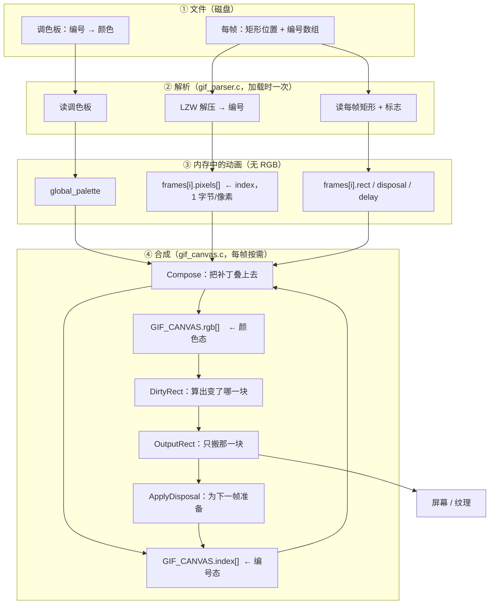

# GIF 基础概念图解 —— 索引、调色板、画布与合成

> 这是一篇**入门图解**。它回答的是"这些名词到底是什么意思"：索引是什么、调色板是什么、画布是什么、合成在做什么。
>
> 想深入"怎么实现、哪里容易出错"，请看 [Architecture.zh-CN.md](./Architecture.zh-CN.md)。

本文所有图示都用同一个真实用例：`build_check/cases/local_palette_probe.gif`
（62 字节，4×4 画布，1 帧）。所有数字都是从代码里实际跑出来的，不是示意值。

---

## 1. 一个 GIF 文件里到底有什么

**最核心的观念：GIF 不存颜色，它存"编号"。**

```
文件内容（概念上的样子）
┌──────────────────────────────────────────────┐
│ 头部 "GIF89a"                                 │
├──────────────────────────────────────────────┤
│ 逻辑屏幕描述符：画布 4×4，背景索引 = 0          │
├──────────────────────────────────────────────┤
│ 全局调色板 GCT（全文件通用的「颜色字典」）      │
│     编号 0 → 红(255,0,0)                     │
│     编号 1 → 绿(0,255,0)                     │
│     编号 2 → 蓝(0,0,255)                     │
│     编号 3 → 黄(255,255,0)                   │
├──────────────────────────────────────────────┤
│ 图形控制扩展 GCE：延迟、透明索引、disposal      │
├──────────────────────────────────────────────┤
│ 图像块 #0                                    │
│   位置 (0,0)，大小 2×2     ← 只是画布的一小块  │
│   局部调色板 LCT（这一帧专用，可以覆盖 GCT）    │
│     编号 0 → 蓝(0,0,255)   ← 注意！和 GCT 不同 │
│     编号 1 → 绿(0,255,0)                     │
│   像素数据（LZW 压缩）→ 解压后：1 0 0 1  ← 只存编号 │
├──────────────────────────────────────────────┤
│ 图像块 #1（如果有更多帧，同样只存自己那块）     │
├──────────────────────────────────────────────┤
│ trailer ';'                                  │
└──────────────────────────────────────────────┘
```

两个关键点：

1. **图像块只是画布上的一小块（矩形）**，不是整幅图。这个例子里画布是 4×4，而唯一的帧只有 2×2。
2. **编号的含义依赖"用哪张字典"**。同一个编号 0，在全局调色板里是红色，在这帧的局部调色板里是蓝色。

---

## 2. 解析做了什么

解析的工作是把文件拆成互相独立的两部分——**字典**和**编号**：

```
                    GIF 文件
                       │
        ┌──────────────┴───────────────┐
        ▼                              ▼
   ①「字典」部分                    ②「编号」部分
   调色板（GCT / LCT）             每帧的矩形 + 编号
   尺寸、背景、延迟、disposal         ↓
        │                         LZW 解压
        │                              │
        │                              ▼
        │                     ┌──────────────────┐
        │                     │ frame.pixels[]   │
        │                     │  1 0             │ ← 只有 2×2！
        │                     │  0 1             │   1 字节/像素
        │                     └──────────────────┘
        │                              │
        └──────────────┬───────────────┘
                       ▼
              IMG_ANIMATION（就这些）
              ┌────────────────────────────┐
              │ width=4  height=4  count=1  │
              │ global_palette (4 色)       │
              │ background_index = 0        │
              │ frames[0]                   │
              │   pixels = [1,0,0,1]        │
              │   left=0 top=0 w=2 h=2      │
              │   palette (本帧 LCT)         │
              │   disposal = 2              │
              └────────────────────────────┘
                       │
                       ▼
              ★ 这里面没有任何 RGB 像素！
                 只有"编号 + 位置 + 字典"
```

**这一步就是内存大幅下降的原因。** 旧方案在这里会把 4×4 的整幅 RGB 画布存下来（48 字节），而实际只需要 `[1,0,0,1]`（4 字节）。放到真实素材上，差距就是几百 MB 到十几 MB。

---

## 3. 什么是 index（索引）

**index 就是"编号"——指向调色板的第几项，而不是颜色本身。**

```
编号（index）              查字典                 颜色（RGB）
   1        ──────►  本帧 LCT[1]  = 绿   ──────►   (0,255,0)
   0        ──────►  本帧 LCT[0]  = 蓝   ──────►   (0,0,255)
```

**为什么必须区分这两者？** 因为同一个 index 在不同帧可能对应不同颜色：

```
              index 0 的含义
GCT[0]  →  (255,0,0) 红      ← 全局字典说是红
LCT[0]  →  (0,0,255) 蓝      ← 本帧字典说是蓝     ★ 冲突！
```

这不是编造的极端情况：`assets/8yori.gif` 每一帧都有自己的局部调色板，而它们和全局表对索引 0 的解释完全不同。

所以代码里两处必须分清楚：

| 位置 | 存什么 | 大小 |
|---|---|---|
| `GIF_FRAME_INFO.pixels[]` | **index**（编号） | 1 字节/像素 |
| 渲染出的 `IMG_FRAME` | **RGB**（颜色） | 3 字节/像素 |

---

## 4. 什么是 canvas（画布）

**canvas 是"一张持续存在的图"，它跨帧保留状态。**

它同时维护两个并行视图（一个存"编号"，一个存"颜色"）：

```
GIF_CANVAS (4×4)

   index[]  ← 每个像素当前"是几号"          rgb[]  ← 每个像素当前"长什么样"
   ┌───┬───┬───┬───┐                      ┌─────────┬─────────┬─────────┬─────────┐
   │ 0 │ 0 │ 0 │ 0 │  初始：背景索引 0     │ 红      │ 红      │ 红      │ 红      │
   ├───┼───┼───┼───┤  （GCT[0]=红）        ├─────────┼─────────┼─────────┼─────────┤
   │ 0 │ 0 │ 0 │ 0 │                      │ 红      │ 红      │ 红      │ 红      │
   ├───┼───┼───┼───┤                      ├─────────┼─────────┼─────────┼─────────┤
   │ 0 │ 0 │ 0 │ 0 │                      │ 红      │ 红      │ 红      │ 红      │
   ├───┼───┼───┼───┤                      ├─────────┼─────────┼─────────┼─────────┤
   │ 0 │ 0 │ 0 │ 0 │                      │ 红      │ 红      │ 红      │ 红      │
   └───┴───┴───┴───┘                      └─────────┴─────────┴─────────┴─────────┘
```

### 为什么需要两套？

* `rgb[]` 是**出图必需**的。因为**继承下来的像素，它的颜色无法从（index + 当前帧调色板）反推**——那个 index 当初是按**另一张**字典写进去的。
* `index[]` 是同一张画布在**索引域**的样子，disposal 3 会连它一起快照、恢复。

这里要说清一个容易想当然的地方：**透明判定用的不是 `index[]`**，而是"本帧解出来的索引 == 本帧的透明索引"；disposal 2 的回填也是直接写入背景索引，不读画布。

```
  本帧解出的索引 v  ──┐
                      ├──►  v == frame.transparent_index ? 跳过 : 写入
  frame.transparent_index ──┘        （和画布上的 index[] 无关）
```

当前代码里对 `canvas->index` 的**全部读取**都发生在 disposal 3 的快照里（`GIFCanvasCompose` 里那次 `memcpy(canvas->saved + ..., canvas->index + offset, ...)`），所以它目前是一个"只写、只被自己快照恢复"的视图。保留它是为了让画布状态自描述，也是将来做索引域优化（换调色板重绘、按最小差异上传）的基础；只留 `rgb[]` 并不会把画面画错。（自己核对：`grep -n "canvas->index" gif_canvas.c`，唯一的读取就是那一行。）

用一个真实例子说明（`assets/8yori.gif`，180×200，8 帧，每帧都有自己的 LCT）：

```
画布上某个像素，它的 index = 0

  用「本帧的 LCT」解释 index 0  →  (0,0,112)      ✗ 错（深蓝）
  用「全局的 GCT」解释 index 0  →  (115,246,18)   ✓ 对（黄绿）

  对 8yori.gif 来说：8/8 帧的 LCT[0] 都是 (0,0,112)，
  而 GCT[0] 是 (115,246,18)。这个文件所有帧的 disposal 都是 2、
  并且都把索引 0 声明为透明色，所以"索引 0"的像素永远不会被任何一帧画上去，
  它显示的一直是画布初始化（以及 disposal 2 回填）时用 GCT 解释出来的背景色。
```

也就是说：**只有把颜色本身记下来，才不会画错。** 这就是 `rgb[]` 存在的唯一理由。

（`--conflicts` 会把这件事按文件列出来，见第 9 节。）

另外，**整个程序里只有一份画布**（不是每帧一份），所以它的开销与帧数无关：

| 缓冲 | 何时分配 | 大小 |
|---|---|---|
| `index[]` | 创建画布时 | `宽 × 高 × 1` |
| `rgb[]` | 创建画布时 | `宽 × 高 × 3` |
| `saved`（disposal 3 的快照） | 只有真的出现 disposal 3 才分配 | `宽 × 高 × 4`（index + rgb 各一份） |

1000 帧也好，8 帧也好，画布都是这么多。（`build_check/leakcheck.c` 会在第二遍播放时断言"一个字节都没再分配"，这条结论就是从那里来的。）

---

## 5. 合成：把"小块补丁"叠到画布上

每显示一帧，固定三步：

### 第 1 步 `GIFCanvasCompose` —— 只动那一小块

```
  帧的补丁：          画布 index[]              画布 rgb[]
  ┌───┬───┐          ┌───┬───┬───┬───┐        ┌─────────┬─────────┬───┬───┐
  │ 1 │ 0 │          │ 1 │ 0 │ 0 │ 0 │        │ 绿      │ 蓝      │ 红 │ 红 │
  ├───┼───┤   ──►    ├───┼───┼───┼───┤        ├─────────┼─────────┼───┼───┤
  │ 0 │ 1 │          │ 0 │ 1 │ 0 │ 0 │        │ 蓝      │ 绿      │ 红 │ 红 │
  └───┴───┘          ├───┼───┼───┼───┤        ├─────────┼─────────┼───┼───┤
  用本帧 LCT 查色     │ 0 │ 0 │ 0 │ 0 │        │ 红      │ 红      │ 红 │ 红 │
                     ├───┼───┼───┼───┤        ├─────────┼─────────┼───┼───┤
  1 = LCT[1] = 绿     │ 0 │ 0 │ 0 │ 0 │        │ 红      │ 红      │ 红 │ 红 │
  0 = LCT[0] = 蓝     └───┴───┴───┴───┘        └─────────┴─────────┴───┴───┘
                                                   ↑ 外面这块没被动过，
                     ★ 只改了 4 个像素               仍是初始化时的背景红
```

透明像素会被**完全跳过**：连 `index[]` 都不写，所以那个位置保留的就是之前的内容。

### 第 2 步 `GIFCanvasOutput` —— 把画布交出去

```
  (0,255,0) (0,0,255) (255,0,0) (255,0,0)
  (0,0,255) (0,255,0) (255,0,0) (255,0,0)     ← 这就是屏幕上看到的这一帧
  (255,0,0) (255,0,0) (255,0,0) (255,0,0)
  (255,0,0) (255,0,0) (255,0,0) (255,0,0)
```

（实际输出值已与代码逐像素核对过：这四行就是 `build_check/concepts_probe.py` 打出来的结果。）

**这一步有两种做法，值得分清：**

* `GIFCanvasOutput` 把**整幅**画布拷出来。适合"我要一张独立的图片"——比如生成 BMP。
* `GIFCanvasDirtyRect` + `GIFCanvasOutputRect` 只拷**变化的那块**。播放器用这种：屏幕/纹理里本来就有上一帧，没必要每帧重画整幅。

```
   本帧矩形          上一帧的 disposal       脏矩形 = 两者并集
  ┌────────┐        改了哪些像素？        ┌──────────────┐
  │ 2×2    │   ∪    disposal 2/3 →      │ 只是这两块，  │
  └────────┘        上一帧的矩形          │ 其余没变      │
                     disposal 0/1 → 无    └──────────────┘
```

本例只有一帧，所以"脏"就是整幅画布（第 0 帧永远是整幅，因为屏幕上一开始什么都还没有）。

> 小细节：`IMG_FRAME` 结构体里字段顺序是 `r, g, b`，但 BMP 文件要求 BGR，
> 所以**写出 BMP 的那一刻**才交换成 `b, g, r` 并倒着写行（BMP 是自下而上的）。
> 画布内部始终保持 `r, g, b`。

### 第 3 步 `GIFCanvasApplyDisposal` —— 为下一帧准备画布

本例 `disposal = 2`（恢复到背景）：

```
  ┌───┬───┬───┬───┐
  │ 红 │ 红 │ 0 │ 0 │   ← 刚画的 2×2 矩形被背景色填回
  │ 红 │ 红 │ 0 │ 0 │     下一帧就从这里开始
  │ 0 │ 0 │ 0 │ 0 │
  │ 0 │ 0 │ 0 │ 0 │
  └───┴───┴───┴───┘
```

### 为什么顺序必须是「绘制 → 输出 → disposal」

因为 disposal 描述的是"这一帧**显示完之后**画布该是什么样"。如果先做 disposal，第 2 步输出的画面就已经被覆盖掉了——矩形里**刚画上去的像素**会被背景色抹掉。这是本项目里真实出现过、并且修过两次的 bug。

四种 disposal 的含义：

| 值 | 含义 | 对画布做什么 |
|---|---|---|
| 0 | 未指定 | 不动 |
| 1 | 不处置 | 不动 |
| 2 | 恢复到背景 | 用**背景色**填回矩形 |
| 3 | 恢复到之前 | 把绘制前的快照拷回矩形 |

---

## 6. 完整流程



---

## 7. 一句话总结每一层

| 概念 | 一句话 |
|---|---|
| **调色板** | 字典：编号 → 颜色。最多 256 项，可以有全局的（GCT）和每帧局部的（LCT） |
| **index（索引）** | 编号，指向调色板第几项。**它不是颜色**，含义取决于用哪张字典 |
| **矩形（rect）** | 这一帧覆盖画布的哪一小块，以及那一小块里的编号 |
| **canvas（画布）** | 一张持续存在的图，跨帧保留状态；同时存"编号态"和"颜色态" |
| **合成（compose）** | 按透明规则把一帧的补丁叠到画布上，只动那一小块 |
| **脏矩形（dirty rect）** | 这一帧相对上一帧可能变了的那一块：`本帧矩形 ∪ disposal 会改的上一帧矩形`；播放器只搬这一块 |
| **disposal** | 这帧显示完之后，画布要恢复成什么样（为下一帧准备） |

---

## 8. 这套分层为什么决定了代码结构

```
     gif_parser.c                        gif_canvas.c
  ┌────────────────────┐            ┌────────────────────┐
  │  字节 → 字典+编号    │            │  画布 → 颜色         │
  │                    │            │                    │
  │  · 读文件、块语法    │            │  · 透明判定          │
  │  · LZW 解压         │  ──────►   │  · disposal         │
  │  · 每帧矩形 + 编号   │  index     │  · 交错行序          │
  │                    │  数据       │  · 输出 RGB         │
  │  完全不知道画布      │            │  完全不知道文件布局   │
  └────────────────────┘            └────────────────────┘
```

* `gif_parser.c` **只管把文件变成"字典 + 编号"**，它不知道画布、透明、disposal 的合成语义；
* `gif_canvas.c` **只管把编号叠成画面**，它不知道文件长什么样。

把这两件事分开，是这份代码里最有价值的结构决定——因为它们的**错误表现完全不同**：解析错误是"数据不对"，合成错误是"画面不对"，混在一起会非常难查。

---

## 9. 自己动手验证

本文里每一个数字都是跑出来的，这些命令可以自己复现（`build_check/` 里的工具不参与编译，只是审计脚本）：

```bash
# 本文用到的所有数字：字节数、画布、GCT/LCT、解出的索引、合成后的输出
python build_check/concepts_probe.py build_check/cases/local_palette_probe.gif

# 一个索引在不同帧里含义不同，到底有多常见
python build_check/concepts_probe.py --conflicts assets/8yori.gif

# 只读地看文件结构（帧数、矩形、disposal、透明、交错、子块数）
python build_check/gifstat.py build_check/cases/local_palette_probe.gif

# 端到端：跑真的 parser.exe，把输出的 BMP 解回来，和参考实现逐像素比
make parser
python build_check/verify_assets.py

# 脏矩形那条路：只应用"变化的那块"，屏幕结果仍要和参考实现完全一致
python build_check/verify_dirtyrect.py
python build_check/verify_sdl.py          # 走真实的 SDL 纹理
```

`build_check/ref_composite.py` 是一份**独立按规范实现**的合成器（它的 LZW 在 `build_check/lzwref.py`，同样是按规范另写的），专门用来验证 C 实现的画面是否真的正确——"自己和自己一致"是没有意义的。

这两份参考实现的代价是慢（纯 Python、每个像素一个对象），只适合小文件和抽查；但它们**不是从 C 代码翻译过来的**，所以才会在 C 代码错的时候给出不同答案。
